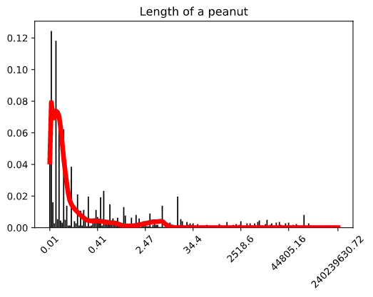
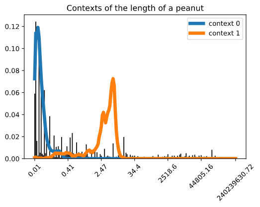
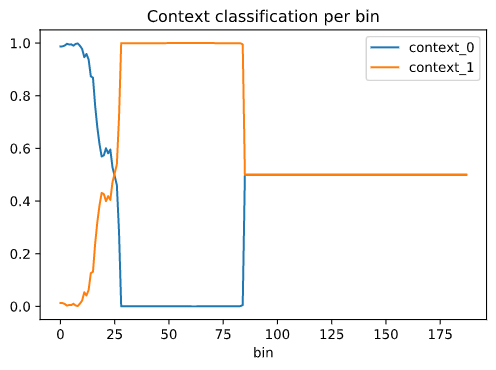

# Reading the Data


There are two folders. The folder `data/statistics/` contains summarized statistics with median, mode, mean, std and quantiles for the smoothed density estimate and for each of the smooth contexts. The folder `data/densities` contains the full smooth densities of the overall distribution and per each context. 


## 1. Summary Statistics

```python
from tqdm import tqdm
from collections import defaultdict
import glob
import json


fpath = "./data/statistics/*.json"
files = glob.glob(fpath)

dat_stats = defaultdict(dict)
for batch_file in tqdm(files):
    with open(batch_file, "r") as io:
        for D in json.load(io):
            obj = D['obj']
            dim = D['dim']
            dat_stats[obj][dim] = D
```
```
100%|██████████| 3196/3196 [00:40<00:00, 78.69it/s]
```

To know the attributes available for an object one can do:
```python
dict_keys(['VOLUME', 'DURATION', 'CURRENCY', 'LENGTH', 'ENERGY', 'MASS'])
```
Here's an example of a data point:
```python
from pprint import pprint
pprint(dat_stats['peanut']['LENGTH'])
```
```python
{'contexts': [{'iqr': 0.050211799102865044,
               'mean': 0.07276037449441695,
               'median': 0.05477225554647405,
               'mode': 0.044721359383395734,
               'quantiles': [0.01414213530762959,
                             0.01414213530762959,
                             0.01414213530762959,
                             0.02449489688032816,
                             0.0346410153770905,
                             0.05477225554647405,
                             0.08485281447995555,
                             0.13490737344531625,
                             0.20493901364685682,
                             0.24910437244510703,
                             0.2883696894412364],
               'std': 0.05690102956832747},
              {'iqr': 3.8070040761728436,
               'mean': 4.016930668039587,
               'median': 4.0194985176355065,
               'mode': 6.235561444821262,
               'quantiles': [0.16492422404890958,
                             0.215185966274198,
                             0.2883696894412364,
                             0.49321022327345754,
                             2.1316262396744423,
                             4.0194985176355065,
                             5.938630315847286,
                             7.579364070170956,
                             7.9583325482333,
                             8.356248961004386,
                             9.2127645972979],
               'std': 2.4346322806542298}],
 'density': {'iqr': 0.11019797581151304,
             'mean': 0.3871935553785176,
             'median': 0.08485281447995555,
             'mode': 0.02449489688032816,
             'quantiles': [0.01414213530762959,
                           0.01414213530762959,
                           0.02449489688032816,
                           0.02449489688032816,
                           0.044721359383395734,
                           0.08485281447995555,
                           0.15491933519490877,
                           0.5709526035732677,
                           2.4676237330281303,
                           4.653071974924999,
                           6.235561444821262],
             'std': 1.1103542231142938},
 'dim': 'LENGTH',
 'n_contexts': 2,
 'obj': 'peanut',
 'wts_counts': [0.918864905834198, 0.08113506436347961],
 'wts_nn': [0.9503931999206543, 0.0496068000793457]}
```

Here's the full full description of the schema for each **(obj, dim)** pair:

- **obj**: str
- **dim**: str
- **n_contexts**: int
- **density**: dict, statistics for global density
- **contexts**: List(dict), statistics the densities of each context
- **weights_nn**: List(float), weight of each context as measured by the neural network model
- **weights_counts**: List(float), weight of each context as measured by assigning to each context the bin counts in the original data proportionally to the value estimate of each density at the bins. 

The dictionary of statistics consists of the following keys:
- **iqr**: float, interquantile range, difference between the first and third quartile
- **median**: float
- **mode**: float, center point of the bin with highest density value
- **quantile**: List(float), correspoding to 1%, 2.5%, 5%, 10%, 25%, 50%, 75%, 90%, 95%, 97.5% and 99%.
- **mean**: float
- **std**: float


### 2. Densities 


Read the data for full densities

```python
fpath = "./data/densities/*.json"
files = glob.glob(fpath)

dat_dens = defaultdict(dict)
for batch_file in tqdm(files):
    with open(batch_file, "r") as io:
        for D in json.load(io):
            obj = D['obj']
            dim = D['dim']
            dat_dens[obj][dim] = D
```
```
100%|██████████| 3196/3196 [02:53<00:00, 18.38it/s]
```

```python
D.keys()
```
```python
dict_keys(['n_bins', 'density', 'peaks', 'n_contexts', 'contexts', 'wts_counts', 'wts_nn', 'counts', 'loglower', 'logupper', 'obj', 'dim'])
```

Plot the smooth density of peanut length

```python
import matplotlib.pyplot as plt


y = np.array(D['density'])
obs = np.array(D['counts'])
n_bins = D['n_bins']
x = 10.0 ** (0.5 * np.array(D['loglower']) + 0.5 * np.array(D['logupper']))

plt.bar(range(n_bins), obs / obs.sum(), color="black")
locs = [(n_bins - 1) * i // 6 for i in range(7)]
labels = [np.round(x[l], 2) for l in locs]
plt.xticks(ticks=locs, labels=labels, rotation=45)
plt.plot(range(n_bins), y, c="red", lw=5)
plt.title("Length of a peanut")
```



```python
 plt.bar(range(n_bins), obs / obs.sum(), color="black")
 
for j, y in enumerate(D['contexts']):
    plt.plot(range(n_bins), y, lw=5, label=f"context {j}")

plt.legend()
plt.xticks(ticks=locs, labels=labels, rotation=45)
plt.title("Contexts of the length of a peanut")
```




It's easy to obtain **label predictions** per bin using the following function


```python
import numpy as np
import pandas as pd

def label_predict(D: dict):
    n_contexts = D['n_contexts']
    densities = np.array(D['contexts'])
    densities /= densities.sum(0) + 1e-6
    densities = {f'context_{j}': d
                 for j, d in enumerate(densities)}
    densities['lower'] = 10 ** np.array(D['loglower'])
    densities['upper'] = 10 ** np.array(D['logupper'])
    densities = pd.DataFrame(densities)
    return densities

D = dat_dens['peanut']['LENGTH']
pred = label_predict(D)
pred.head()
```
```python
    context_0	context_1	lower	upper
0	0.986888	0.013099	0.01	0.02
1	0.987509	0.012483	0.02	0.03
2	0.990730	0.009261	0.03	0.04
3	0.997124	0.002868	0.04	0.05
4	0.994748	0.005243	0.05	0.06
```

```python
pred.plot(y=['context_0', 'context_1'])
plt.title("Context classification per bin")
plt.xlabel("bin")
```




Note that this approach assigns every bin to the class with highest probability among the contexts. However we don't necessarily want to do that if none of the contexts has high probability. In that case, we can use the smooth density to filter out unlikely values after smoothing.
